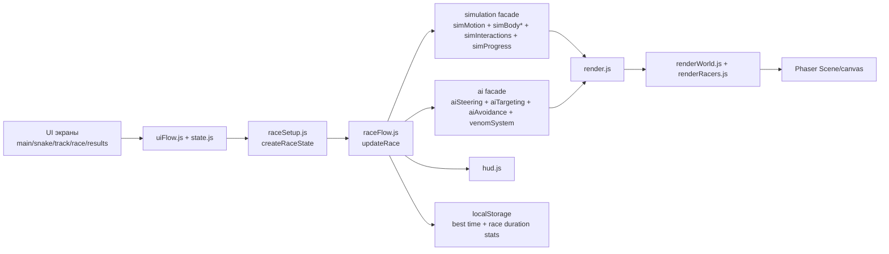
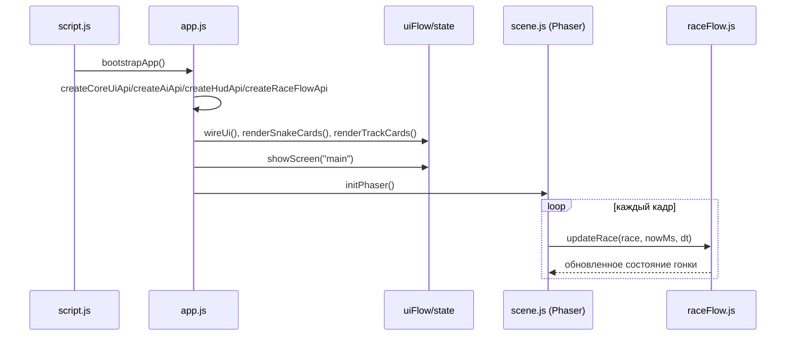
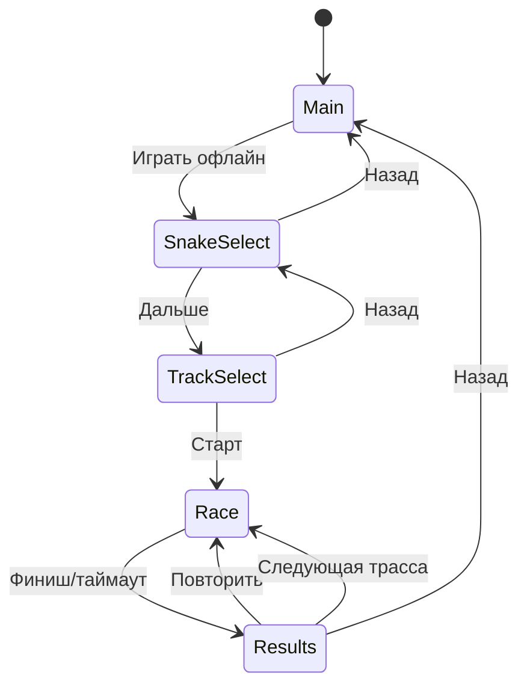
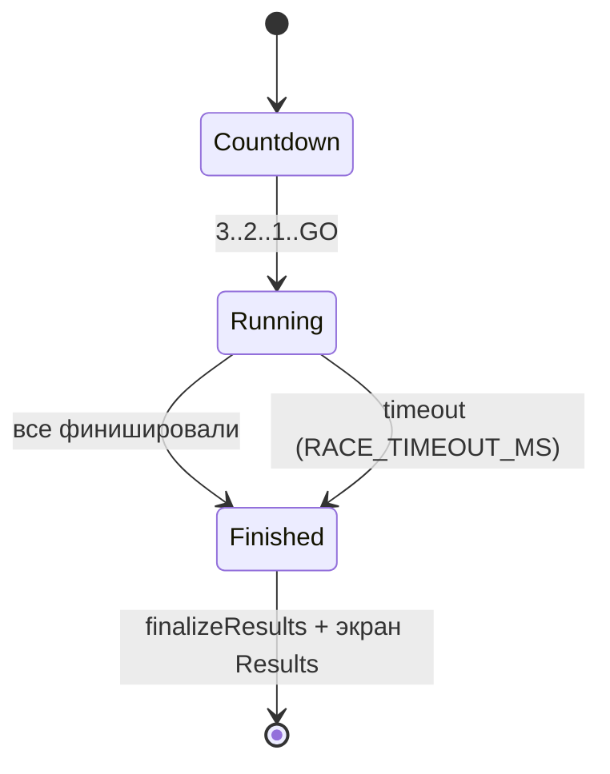
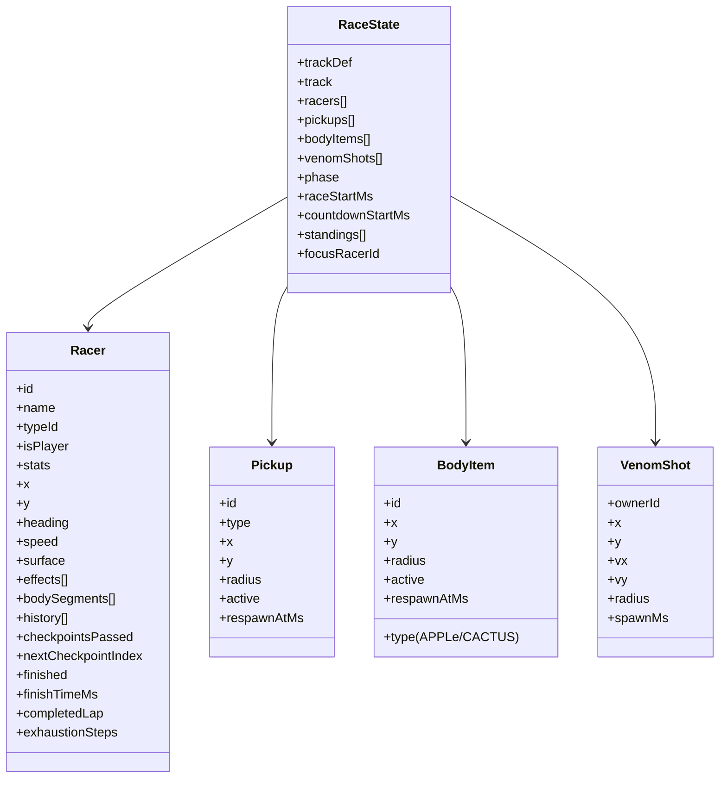
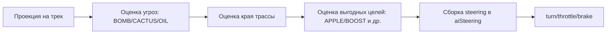
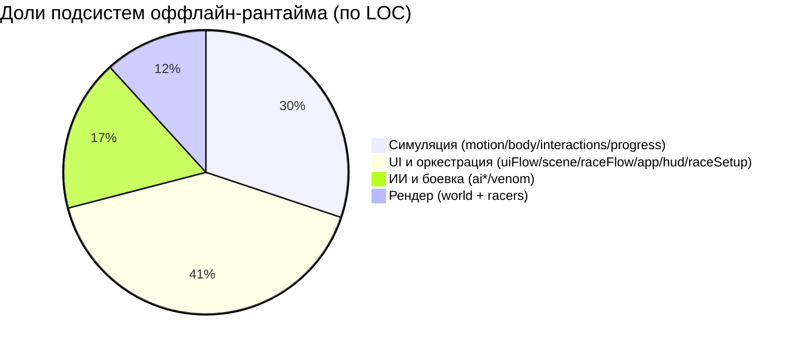

# ПОЛЗУНКИ: Оффлайн-Архитектура (подробно)

## 1. Назначение и границы

Этот документ описывает только локальный (оффлайн) рантайм игры:

- без сетевой authoritative-комнаты;
- без синхронизации по WebSocket;
- с полной симуляцией внутри браузера (`Phaser 3` + модули `src/game/*`).

Онлайн-механики описаны отдельно в `ONLINE_ARCHITECTURE.md`.

## 2. Контур оффлайн-системы



## 3. Последовательность запуска приложения



## 4. Слои и зоны ответственности

### 4.1 Оркестрация

- `src/game/app.js`: композиция всех API, DI между модулями.
- `src/game/raceFlow.js`: фазовый цикл гонки (`countdown -> running -> finished`), завершение, результаты.
- `src/game/raceSetup.js`: создание `RaceState`, стартовые позиции, спавн пикапов/яблок/кактусов.

### 4.2 Симуляция

- `src/game/simMotion.js`: движение, поверхности, coasting после финиша.
- `src/game/simBodyCore.js`: тело/сегменты, heading по направлению движения, speed floor.
- `src/game/simItemEffects.js`: голод, яблоки/кактусы, pickup-эффекты.
- `src/game/simBodyCrossing.js`: контакт с телами и специальные правила змей.
- `src/game/simAntiStall.js`: soft-anti-stall без coordinate snap/телепортаций.
- `src/game/simCollisions.js`: коллизии и штрафы между гонщиками.
- `src/game/simProgress.js`: чекпоинты, прогресс, standings.

### 4.3 ИИ и боевка

- `src/game/aiTargeting.js`: выбор выгодной цели (бафы/яблоки).
- `src/game/aiAvoidance.js`: избегание опасностей и края трассы.
- `src/game/aiSteering.js`: финальный синтез control (`turn/throttle/brake`).
- `src/game/venomSystem.js`: выстрелы ядом, полет, попадания, debuff.

### 4.4 Визуал и UI

- `src/game/scene.js`: Phaser scene, игровой цикл, keep-alive при потере фокуса.
- `src/game/renderWorld.js`: фон, трасса, чекпоинты, pickups/body-items/venom shots.
- `src/game/renderRacers.js`: головы/сегменты/лейблы змей.
- `src/game/hud.js`: HUD метрики, порядок, подписи эффектов.
- `src/game/coreUi.js`: overlay/countdown/toast/формат времени.
- `src/game/uiFlow.js`: переходы экранов, кнопки, клавиши, старт/рестарт/next track.

## 5. Машины состояний

### 5.1 Экраны интерфейса



### 5.2 Фазы заезда



## 6. Пайплайн одного игрового тика (offline)

```mermaid
flowchart TD
  A[scene.update(dt)] --> B{race.phase}
  B -->|countdown| C[обновить countdown overlay + HUD + body segments]
  B -->|finished| D[coasting render + finalizeResults]
  B -->|running| E[updatePickups + updateBodyItems]
  E --> F[цикл по racers]
  F --> G{racer.finished?}
  G -->|yes| H[stepFinishedRacer]
  G -->|no| I[updateRacerHunger]
  I --> J[build control: player или NPC]
  J --> K[stepRacer]
  K --> L[applyBodyCrossingRules]
  L --> M[preventRacerStall]
  M --> N[maybeShootVenom]
  N --> O[updateCheckpointProgress + pickup/body-item collection]
  O --> P[updateVenomShots]
  P --> Q[resolveRacerCollisions]
  Q --> R[updateBodySegmentsForRace]
  R --> S[computeStandings + HUD]
  S --> T{finish condition}
  T -->|true| U[finishRace + overlay FINISH]
  T -->|false| V[continue]
```

## 7. Модель данных рантайма



## 8. Ключевые алгоритмы (offline)

### 8.1 Движение и поверхности

В `stepRacer()` скорость зависит от множителей:

`maxSpeed = snakeMaxSpeed * surfaceMul * effectMul * profileMul * lowBodyMul * exhaustionMul`

Где:

- `surfaceMul` учитывает `road/offroad/outside`;
- `effectMul` берется из активных эффектов (`BOOST/OIL/BOMB_SLOW/APPLE_BOOST/VENOM_SLOW`);
- `lowBodyMul` и `exhaustionMul` отражают длину тела и голод;
- для `outside` применяется дополнительный steer/pull назад к трассе, без телепорта.

### 8.2 Anti-stall без телепортаций

В `simAntiStall.js` используется мягкое восстановление:

- отслеживается отсутствие движения и прогресса в окне времени;
- если змея в клине, корректируется только `heading` + поднимается минимальная скорость;
- включается короткий ghost-window для выхода из контактного клина;
- координаты `x/y` не перескакивают (нет snap на точку трассы).

### 8.3 Логика ИИ



ИИ одновременно:

- избегает опасности;
- избегает вылета с дорожного полотна;
- тянется к выгодным целям (особенно при росте голода).

## 9. Графики (структурные)

Ниже графики по объему кода ключевых модулей оффлайн-цикла (LOC, ориентир для поддержки).

### 9.1 Топ модулей по размеру

```text
uiFlow.js           312 | ██████████████████████████████
simBodyCore.js      243 | ███████████████████████
raceSetup.js        213 | ████████████████████
scene.js            208 | ███████████████████
raceFlow.js         202 | ███████████████████
renderRacers.js     185 | █████████████████
simItemEffects.js   163 | ███████████████
aiAvoidance.js      153 | ██████████████
renderWorld.js      151 | ██████████████
venomSystem.js      143 | █████████████
```

### 9.2 Доли подсистем (сумма LOC по слоям)



### 9.3 Таймлайн одного заезда (логический)

```mermaid
gantt
  title Фазы оффлайн-заезда
  dateFormat  X
  axisFormat %s
  section Race
  Countdown (фикс)        :a1, 0, 3
  Running (до финиша/таймаута) :a2, after a1, 1
  Finish overlay          :a3, after a2, 1.3
```



Примечание: `Running` имеет переменную длительность и ограничен `RACE_TIMEOUT_MS`.

## 10. Локальное хранение данных

- Лучшее время по трассе: `localStorage["snake_drift_best_<trackId>"]`.
- EMA-статистика средней длительности заезда (для скорости анимации заголовка):
  `localStorage["snake_race_duration_stats_v1"]`.
- Имя игрока (для online-потока, не влияет на offline-симуляцию):
  `localStorage["polzunki_player_name_v1"]`.

## 11. Точки расширения без ломки ядра

1. Новый тип pickup: добавить в `catalog.js` и обработку в `simItemEffects.js`.
2. Новый профиль бота: `NPC_PROFILES` + корректировка весов в `aiTargeting.js`/`aiAvoidance.js`.
3. Новый эффект поверхности: расширить расчеты в `simMotion.js`.
4. Новый HUD-показатель: добавить вычисление в `hud.js` без изменения симуляции.
5. Новый стиль трассы: менять только `renderWorld.js` + `trackDef`.

## 12. Инварианты оффлайн-архитектуры

- Один источник истины состояния: `state.race`.
- Один оркестратор шага гонки: `updateRace()` в `raceFlow.js`.
- Симуляция и рендер разделены (модули `sim*` не рисуют).
- Anti-stall не телепортирует змей.
- Финиш всегда завершает заезд через единый путь `finishRace() -> finalizeResults()`.
